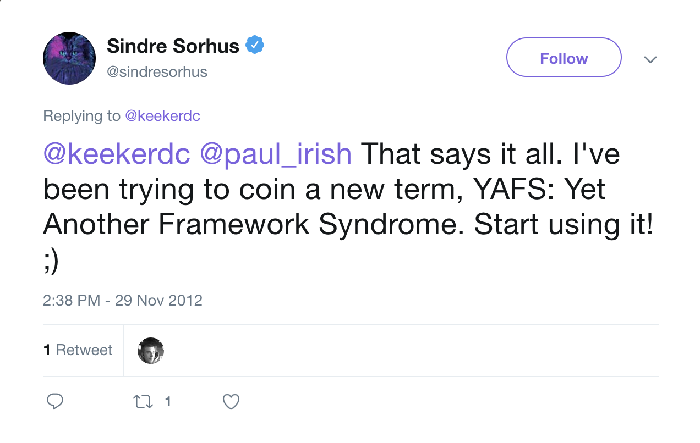
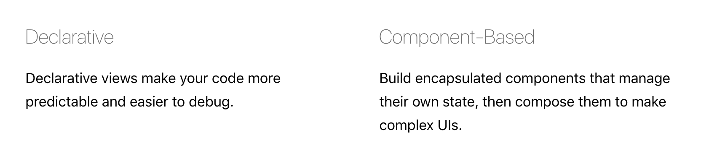
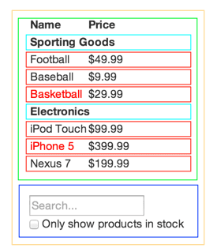
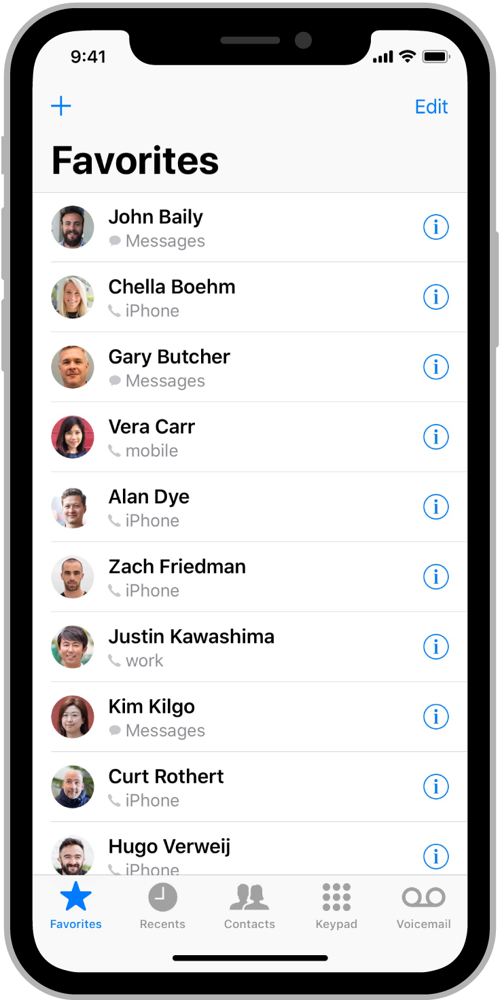
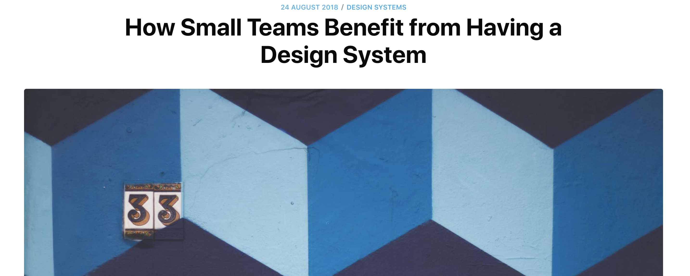
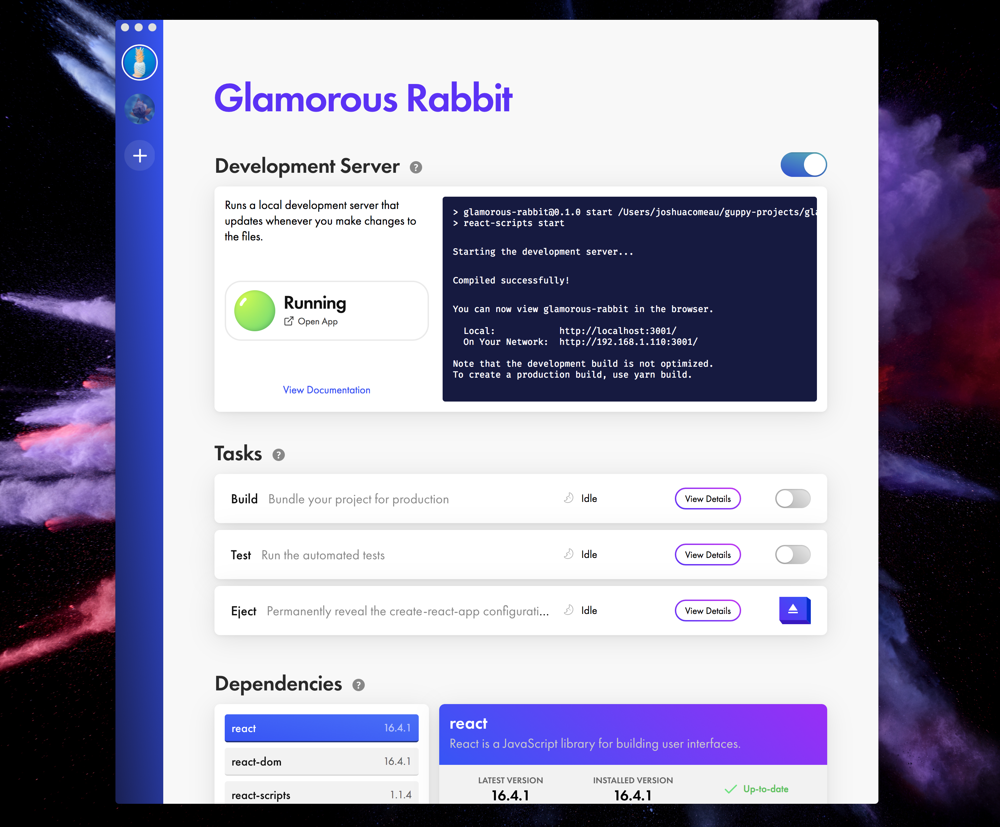
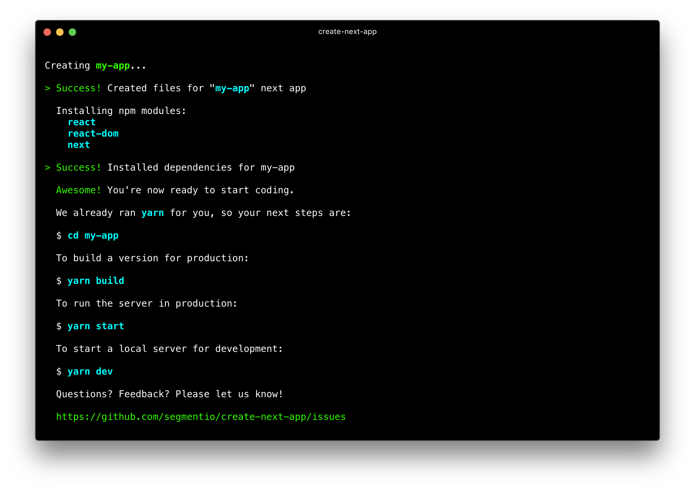

import { Image, Head, Notes, Appear } from 'mdx-deck'
import { Split } from 'mdx-deck/layouts'
import { Invert } from 'mdx-deck/layouts'
import { CodeSurfer } from "mdx-deck-code-surfer"
import dracula from 'prism-react-renderer/themes/dracula'

import nowConfig from './now.json'
import Absolute from './components/absolute-wrapper'

export { default as theme } from './theme'

<Head>
  <link rel="icon" type="image/png" sizes="32x32" href="/favicon-32x32.png" />
  <link rel="icon" type="image/png" sizes="16x16" href="/favicon-16x16.png" />

  <meta name='og:image' content={`https://${nowConfig.alias}.now.sh/card.png`} />

  <meta property="og:type" content="website" />
  <meta property="og:title" content="Why I bet my business on React" />
  <meta property="og:url" content={`https://${nowConfig.alias}.now.sh`}/>
  <meta property="og:image" content={`https://${nowConfig.alias}.now.sh/card.png`} />
  <meta
    property="og:description"
    content="Jess Telford talks on why React was the perfect choice for Cete.io at NDC Sydney 2018"
  />

  <meta name="twitter:card" content="summary_large_image" />
  <meta name="twitter:creator" content="@jesstelford" />
  <meta name="twitter:url" content={`https://${nowConfig.alias}.now.sh`}/>
  <meta name="twitter:title" content="Why I bet my business on React" />
  <meta name="twitter:image" content={`https://${nowConfig.alias}.now.sh/card.png`} />
  <meta
    name="twitter:description"
    content="Jess Telford talks on why React was the perfect choice for Cete.io at NDC Sydney 2018"
  />

  <link rel="author" href="https://twitter.com/jesstelford" />
  <meta itemProp="name" content="Why I bet my business on React" />
  <meta
    itemProp="description"
    content="Jess Telford talks on why React was the perfect choice for Cete.io at NDC Sydney 2018"
  />
  <meta itemProp="image" content={`https://${nowConfig.alias}.now.sh/card.png`} />
</Head>

# Why I bet my business on React


<small style={{ textAlign: 'right' }}>

[@JessTelford](https://mobile.twitter.com/jesstelford) | [cete.io](https://cete.io)

</small>

```notes
Topics:
- Brief history of frontend
- React
- Powerful patterns in React (that you've seen before)
- Getting Started
```

---

### ℹ️ This presentation has detailed notes ℹ️

Press `Option`+`p` to see them

```notes
👋 Hi there!

Detailed notes for each slide will show here.

Press ➡ to see the next slide.
```

---

## `> whoami`

<Appear>

</Appear>

```notes
- I'm a Frontend dev
- Worked at big companies: Yahoo, Groupon, Domain
- Worked at startups: Winged Media, Zibbet, Nnooo!
- Family man (I dressed the kids!)
- Now: My own startup called Cete
```

---

export default Split

<div style={{ textAlign: 'center' }}>

  ## Cete

  

</div>

<Appear>
<div>
<div style={{ width: 'auto' }}>

  > Cete.io helps meetup organisers coordinate Speakers, Sponsorships, and Communities

</div>
</div>
</Appear>

```notes
- "Cete" is the collective noun for badgers
- Cete is tackling the problems organisers have with existing platforms.
- I'm an organiser of React Sydney, so these are also my own pain points.
- Cete is built in Node + GraphQL + React
- I want to tell you why React
- But first, some history!
```

---

export default Invert

# Brief history of frontend

---

# Just HTML

```notes
- HTML: 1993
- JS: 1995
- CSS: 1996
- CSS & JS very slow
  - No consistency
```

---

<CodeSurfer
  code={require("!raw-loader!./snippets/spacejam.com.html")}
  lang="html"
  showNumbers={false}
  dark={false}
  theme={dracula}
/>

---

<Image src='./images/spacejam.png' />

```notes
- Launced in 1996
- Still live today: spacejam.com
```

---

# Web 2.0

> "The Noughties"

---

| 2004            | 2006                      | 2007  |
|-----------------|---------------------------|-------|
| Gmail<br />DOJO | YUI<br />jQuery<br />SASS | ExtJS |

```notes
Great, but about smoothing rough edges only
Birth of "SPA" (but term not used yet)
```

---

### '10s

> HTML5 / Universal JS

---

<small>
<div style={{ border: '1px solid gray', fontSize: '0.8em' }}>
Build Tools

| 2010      | 2011       | 2012               | 2015   | 2017   |
|-----------|------------|--------------------|--------|--------|
| RequireJS | Browserify | Webpack<br />Grunt | Rollup | Parcel |

</div>
<br />
</small>

<Appear>
<small>
<div style={{ border: '1px solid gray', fontSize: '0.8em' }}>
Frameworks

| 2010    | 2011                | 2012   | 2013  | 2014 |
|---------|---------------------|--------|-------|------|
| Angular | Knockout<br />Ember | Meteor | React | Vue  |

</div>
<br />
</small>
<small>
<div style={{ border: '1px solid gray', fontSize: '0.8em' }}>
Frameworks of Frameworks

| 2016                 | 2015(?)           |
|----------------------|-------------------|
| Next.js<br />Nuxt.js | Angular Universal |

</div>
</small>
</Appear>

```notes
- Explosion in growth of frontend
- Some other terms:
  - Single Page App: 2012
  - "Isomorphic JS": 2013
```

---

# Fatigued?

<Appear>
  <div>
  

<div style={{ fontSize: '0.5em' }}>

\- [Sindre Sorhus](https://twitter.com/sindresorhus/status/274281235570892802)

</div>
  </div>
</Appear>

```notes
Me too.

- "Javascript Fatigue": 2015
- "Framework Fatigue": 2014
- "Yet Another Framework Syndrome": 2012 
```

---

export default Invert

# React


```notes
I picked React, and glad I did.
No more fatigue for me!
```

---

[reactjs.org:](https://reactjs.org)



```notes
- These two points really encapsulate the promise of React, and are what make it
  so powerful
- Without either of these two points, it wouldn't be the great tool it is today
```

---

## Thinking in React

<div style={{ display: 'flex', flexDirection: 'row', justifyContent: 'space-between', alignItems: 'center' }}>
<Appear>



</Appear>
</div>

```notes
- Mock from designer
- Assume a json API exists
- What's the view heirarchy?
- What's repeated?
- Rearranging things is "just move the blocks"
```

---

<div style={{ fontSize: '0.7em', display: 'flex', flexDirection: 'row', justifyContent: 'space-between' }}>
<div style={{ display: 'flex', flexDirection: 'column', alignItems: 'center' }}>

<div style={{ position: 'relative', whiteSpace: 'nowrap' }}>
<Appear>
<small>

- `FilterableProducts` (orange)
- `SearchBar` (blue)
- `Products` (green)
- `CategoryRow` (turquoise)
- `ProductRow` (red)

</small>
<React.Fragment></React.Fragment>
<Absolute top={0}>
<small>
<div style={{ backgroundColor: 'white' }}>

- `FilterableProducts` (orange)

<div style={{ paddingLeft: '3em' }}>

- `SearchBar` (blue)
- `Products` (green)

<div style={{ paddingLeft: '3em' }}>

- `CategoryRow` (turquoise)
- `ProductRow` (red)

</div>
</div>
</div>
</small>
</Absolute>
<Absolute top={0}>
<small>
<div style={{ backgroundColor: 'white' }}>

- `FilterableProducts` (orange)

<div style={{ paddingLeft: '3em' }}>

- `SearchBar` (blue)
- `Products` (green)

<div style={{ paddingLeft: '3em', color: 'lightgray' }}>

- `CategoryRow` (turquoise)
- `ProductRow` (red)

</div>
</div>
</div>
</small>
</Absolute>
</Appear>
</div>
</div>

<div style={{ display: 'flex', flexDirection: 'column', alignItems: 'center', position: 'relative', marginLeft: '3em' }}>


<div style={{ position: 'relative', whiteSpace: 'nowrap' }}>
<Appear>
<React.Fragment></React.Fragment>
<small>

- `FilterableProducts` (orange)
- `Products` (green)
- `CategoryRow` (turquoise)
- `ProductRow` (red)
- `SearchBar` (blue)

</small>

<Absolute top={0}>
<small>
<div style={{ backgroundColor: 'white' }}>

- `FilterableProducts` (orange)

<div style={{ paddingLeft: '3em' }}>

- `Products` (green)

<div style={{ paddingLeft: '3em' }}>

- `CategoryRow` (turquoise)
- `ProductRow` (red)

</div>

- `SearchBar` (blue)

</div>
</div>
</small>
</Absolute>

<Absolute top={0}>
<small>
<div style={{ backgroundColor: 'white' }}>

- `FilterableProducts` (orange)

<div style={{ paddingLeft: '3em' }}>

- `Products` (green)

<div style={{ paddingLeft: '3em', color: 'lightgray' }}>

- `CategoryRow` (turquoise)
- `ProductRow` (red)

</div>

- `SearchBar` (blue)

</div>
</div>
</small>
</Absolute>
</Appear>
</div>

</div>
</div>

```notes
- The Heirarchy is the ah-hah moment
- Each one is called a "Component"
- With React, you can move them around as much as you like!
```

---

## _"Components unlock the frontend"_

\- me

```notes
- Why is that important?
- How does this help Cete?
  - I've built a lot of frontends
  - I've refactored a lot of frontends
  - Websites need to adapt / change
  - In startups, that's even more important
  - Pairs with the way Designers work, using...
```

---

### Design Systems

<div style={{ display: 'flex', flexDirection: 'row' }}>

<Appear>
<div>

</div>

<div>

</div>
</Appear>

</div>

```notes
Left: Google, right: iOS
- Only 2, lots of others around
- This is designers taking advantage of the ability to remix pieces
- Fine for these huge companies with 1000's of designers, what about my company Cete?
```

---



<small style={{ fontSize: '0.5em', textAlign: 'center' }}>

Mariusz Ciesla | [writing.mariusz.cc/lean-startup-design-systems](http://writing.mariusz.cc/lean-startup-design-systems/)

</small>

```notes
- Enables rapid iteration
- Upfront cost for long term gain

- "GAH!" I hear you say: This just means designers are changing things. Still
  have to code it all up which means more work for me :(
- I agree! What if there was a way...
```

---

## Code as the source of Truth

```notes
- Can we get designers on board?
```

---


```notes
- (demo of https://github.com/airbnb/react-sketchapp/tree/master/examples/profile-cards-graphql)
- AirBnB's tool
- Import react components into Sketch
```

---

### FramerX

<video preload="auto" playsinline="" poster="https://pbs.twimg.com/tweet_video_thumb/Djy0ovCX4Aou48z.jpg" src="https://video.twimg.com/tweet_video/Djy0ovCX4Aou48z.mp4" type="video/mp4" controls loop style={{ maxHeight: '60vh' }}></video>

```notes
- Goes beyond sketch, bases entire tool on React
- _Can_ export code, but they discourage it
- Personally, I think generated code would be a better hand-off than a design asset
```

---

# Everything is a component

```notes
- Once you can think in React, everything looks like a component

- _Pause for a beat_
```

---

export default Invert

# Powerful patterns in React
## _(that you've seen before)_

```notes
- Not all the benefits of react are design-related!
- Can use existing design patterns for much win.
```

---

## The (incredibly small) API of a React Component

```notes
- First, a refresher
```

---

<CodeSurfer
  code={require("!raw-loader!./snippets/react-api.js")}
  lang="jsx"
  showNumbers={false}
  theme={dracula}
  steps={[
    { lines: [7] },
    { range: [1, 5] },
    { tokens: {
      3: [8, 9, 10, 11, 12],
    } },
    { tokens: {
      3: [8, 9, 10, 11, 12],
      7: [7, 8, 9, 10, 11]
    } }
  ]}
/>

```notes
1. Entry point
2. Component
3. Where does `this.props.name` come from?
4. It comes from `name="Jane"`
```

---

## Multiple Components

---

<CodeSurfer
  code={require("!raw-loader!./snippets/react-api-nested.js")}
  lang="jsx"
  showNumbers={false}
  theme={dracula}
  steps={[
    { range: [2, 15] },
    { lines: [7, 17, 20] },
    { range: [7, 15] },
    {
      tokens: {
        10: [3, 4, 5, 6, 7, 8, 9, 10, 11, 12, 13, 14],
      },
      lines: [7, 11, 12, 15],
    },
    {
      range: [1, 7],
      lines: [11, 15],
    },
    {
      range: [1, 1000],
    },
  ]}
/>

```notes
1. 2 components
2. `HelloEveryone` is entry point
3. `HelloEveryone` component
4. `map`s over items, rendering each
5. Just like last time
6. Nested Lego Blocks
```

---

## Pattern #1
### _Single Responsibility Principle_

---

<CodeSurfer
  code={require("!raw-loader!./snippets/react-api-nested.js")}
  lang="jsx"
  showNumbers={false}
  theme={dracula}
/>

```notes
- Take the previous example
- Why not smoosh it down a bit?
```

---

<CodeSurfer
  code={require("!raw-loader!./snippets/pattern-srp.js")}
  lang="jsx"
  showNumbers={false}
  theme={dracula}
  steps={[
    {
      lines: [1, 5, 15],
      tokens: {
        4: [3, 4, 5, 6, 7, 8, 9],
      },
    },
  ]}
/>

```notes
- Simplified view
- Looks good for now, but what about as more things get added?
```

---

<CodeSurfer
  code={require("!raw-loader!./snippets/pattern-srp-bad.js")}
  lang="jsx"
  showNumbers={false}
  theme={dracula}
  steps={[
    { range: [6, 8] },
    { range: [10, 14] },
  ]}
/>

```notes
- Two responsibilities!
```

---

<CodeSurfer
  code={require("!raw-loader!./snippets/pattern-srp-good.js")}
  lang="jsx"
  showNumbers={false}
  theme={dracula}
  steps={[
    { range: [18, 20] },
    { range: [5, 9] },
    { range: [1, 100] },
  ]}
/>

```notes
- Much nicer!
```

---

## Pattern #2
### _Dependency Injection_

---

<CodeSurfer
  code={require("!raw-loader!./snippets/pattern-dep.js")}
  lang="jsx"
  showNumbers={false}
  theme={dracula}
  steps={[
    { range: [21, 25] },
  ]}
/>

```notes
- Note the Wrapper
```

---

<CodeSurfer
  code={require("!raw-loader!./snippets/pattern-dep-bad.js")}
  lang="jsx"
  showNumbers={false}
  theme={dracula}
  steps={[
    {
      lines: [33, 38],
      range: [14, 24],
    },
  ]}
/>

```notes
- But! It's taken the `Message` component
- Can't re-use FancyBox :(
```

---

<CodeSurfer
  code={require("!raw-loader!./snippets/pattern-dep-good.js")}
  lang="jsx"
  showNumbers={false}
  theme={dracula}
  steps={[
    {
      lines: [19, 20, 21, 22, 23, 29],
      range: [1, 10],
    },
    {
      lines: [1, 6, 20, 21, 22, 29],
    },
  ]}
/>

```notes
- Now we can re-use the FancyBox component
```

---

## Pattern #3
### _Interface Pattern_

```notes
- This is a bit of a stretch of the term!
```

---

<CodeSurfer
  code={require("!raw-loader!./snippets/pattern-interface-bad.js")}
  lang="jsx"
  showNumbers={false}
  theme={dracula}
  steps={[
    {
      lines: [1, 21, 29],
    },
  ]}
/>

```notes
- Added a new class
- But something's leaked - this class belongs to the `FancyBox` component, why
  is hard coded as a prop for the `Message` component?
```

---

<CodeSurfer
  code={require("!raw-loader!./snippets/pattern-interface-good.js")}
  lang="jsx"
  showNumbers={false}
  theme={dracula}
  steps={[
    {
      lines: [1, 6, 20, 21, 22, 29],
    },
    {
      lines: [1, 29],
      tokens: {
        6: [6, 7, 8, 9, 10, 11, 12, 13, 14, 15],
      }
    },
    {
      lines: [1, 29],
      tokens: {
        6: [6, 7, 8, 9, 10, 11, 12, 13, 14, 15],
        20: [2, 3, 4, 5, 6, 7, 8],
      }
    },
    {
      lines: [1, 29],
      tokens: {
        6: [6, 7, 8, 9, 10, 11, 12, 13, 14, 15],
        20: [2, 3, 4, 5, 6, 7, 8],
        21: [10, 11, 12, 13, 14],
      }
    },
    {
      lines: [1, 19, 20, 21, 22, 23, 29],
    },
  ]}
/>

```notes
1. Function as a child
2. Use `children` same as previous example, but it's now a function that must be executed
3. Here's the function
4. No more leaky variables!
5. Ideally, we'd factor this out into its own component
```

---

<CodeSurfer
  code={require("!raw-loader!./snippets/render-props.js")}
  lang="jsx"
  showNumbers={false}
  theme={dracula}
/>

```notes
- Previous example was a bit verbose, here's a simplified one to help grok it
- From react docs - very simple "function as a child"
```

---

Plus lots more!

<small>

- [Advanced React Component Patterns](https://egghead.io/courses/advanced-react-component-patterns) (by Kent C Dodds)

</small>

```notes
Excellent series of online videos you should check out
```

---

export default Invert

## Getting Started

```notes
- Convinced?
- Ok, here's some practical take aways for getting started on your own React journey
```

---


```bash
npx create-react-app my-app
```

```notes
- Remember all those build tools from earlier?
- You still need them. But create-react-app hides it all away nice and neatly for you
- Gives you everything you need to create a _client side_ react component
- No server infrastruture or rendering included
```

---



<small>

- Guppy: [github.com/joshwcomeau/guppy](https://github.com/joshwcomeau/guppy)

</small>

```notes
- Guppy
- A nice GUI for running create-react-app
- Very polished UX!
```

---


```notes
- Framework on a framework
- Provides basic server-side code
- Provides server side rendering of react components
- Light weight wrapper
```

---



<small style={{ fontSize: '0.7em' }}>

```bash
> npx create-next-app --example with-styled-components
```

</small>
<small style={{ fontSize: '0.5em' }}>

(more examples: [github.com/zeit/next.js/tree/master/examples/](https://github.com/zeit/next.js/tree/master/examples/))

</small>

```notes
- Quickest way to get started is with an example project
```

---

export default Invert

# 🤗 Thanks!

[@JessTelford](https://mobile.twitter.com/jesstelford) | [cete.io](https://cete.io)
